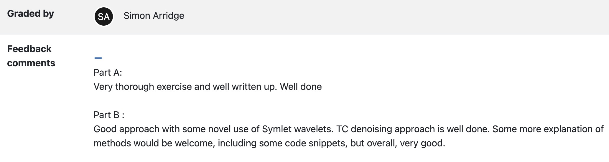

# Final Coursework: Mini Project

## Summary
The final coursework is a mini project, which will be handed out in week 8. The coursework is divided into two parts:

- **Part A**: This part is compulsory for everyone.
- **Part B**: This part offers a number of choices for advanced topics.

### Description of Part A
Here is the description of part A.

### Description of Part B
Here is the description of Part B.

## Data
You will need data for this project, which is available in both Matlab and Python formats:

- [Matlab format data](http://www0.cs.ucl.ac.uk/staff/S.Arridge/teaching/optimisation/CW4_miniprojects/SLphan.mat)
- [Python format data](http://www0.cs.ucl.ac.uk/staff/S.Arridge/teaching/optimisation/CW4_miniprojects/SLphan.npy)

If these links are problematic, please copy and paste the URLs directly into your browser.

## Hints
Here are some hints for Part A, available in both Matlab and Python formats:

- [Matlab hints](#)  (You can add the link here)
- [Python hints](#)  (You can add the link here)

## Feedback Comments
### Part A
- Very thorough exercise and well written up. Well done.

### Part B
- Good approach with some novel use of Symlet wavelets. TC denoising approach is well done. Some more explanation of methods would be welcome, including some code snippets, but overall, very good.

## Image

